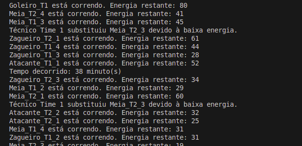
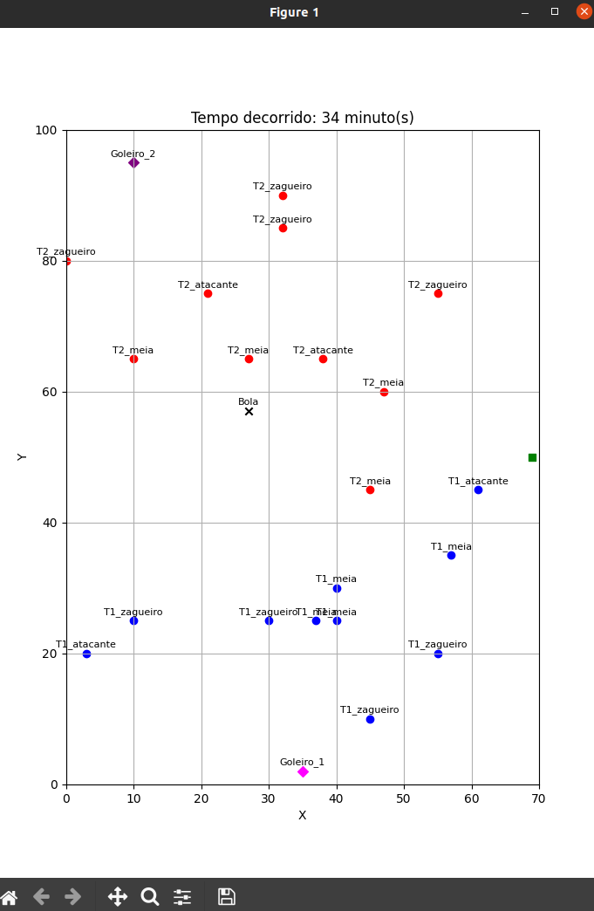

# Football Simulation

Paradigma:
 - SMA - Sistema Multiagente
   
**Disciplina**: FGA0210 - PARADIGMAS DE PROGRAMAÇÃO - T01 <br>
**Nro do Grupo (de acordo com a Planilha de Divisão dos Grupos)**: 05<br>
**Paradigma**: SMA - Sistema Multiagente<br>

## Alunos
|Matrícula | Aluno |
| -- | -- |
| 19/0113596  |  Charles Manrique Serafim Morais |
| 19/0045485  |  Eduardo Gurgel Pereira de Carvalho |
| 19/0125829  |  Ian da Costa Gama |
| 19/0134623  |  Marcos Diego da Silva Gomes |
| 19/0058587  |  Matheus Raphael Soares de Oliveira |
| 14/0158278  |  Pedro Helias Carlos  |
| 21/1006957  |  Sebastián Héctor Zuzunaga Rosado  |
| 19/0117508  |  Thiago Cerqueira Borges  |

## Sobre 
O Projeto tenta simular uma partida de futebol em seus aspectos básicos, com 22 jogadores, 11 de cada time, mais 1 árbitro, e 2 técnicos. Há divisões entre as posições dos jogadores, como atacantes, meias, zagueiros e goleiros. Essa sub-divisão aconteceu por conta da limitação de movimentação dos jogadores, para que eles não percorram distâncias e rotas não permitidas (goleiros indo ao ataque, por exemplo). 

## Screenshots

  .
  .


## Instalação 
**Linguagens**: Python<br>
**Tecnologias**: Framework Mesa<br>
(i) Instalar o Framework Mesa: ```pip install --upgrade mesa```<br>
(ii) Instalar o Seaborn em caso de projeto com visualização ```pip install seaborn```<br>
(iii) Documentação do Mesa: [link](https://mesa.readthedocs.io/en/latest/overview.html)


## Uso 
Explique como usar seu projeto.
Procure ilustrar em passos, com apoio de telas do software, seja com base na interface gráfica, seja com base no terminal.
Nessa seção, deve-se revelar de forma clara sobre o funcionamento do software.

## Vídeo
[Vídeo](https://youtu.be/eQKrWqsxFI4)


## Participações
|Nome do Membro | Contribuição | Significância da Contribuição para o Projeto (Excelente/Boa/Regular/Ruim/Nula) |
| -- | -- | -- |
| Charles Manrique Serafim Morais | Não atuou | Nula |
| Eduardo Gurgel Pereira de Carvalho | Foi adicionada a parte da visualização e movimentação dos jogadores e da bola. Foi implementado o agente Técnico, responsável por substituir os jogadores com energia baixa. A movimentação foi visualizada utilizando a biblioteca Matplotlib.  | Boa |
| Ian da Costa Gama | | |
| Marcos Diego da Silva Gomes | Divisão de Jogadores em posições, formação, posicionamento e movimentação de cada time | Boa |
| Matheus Raphael Soares de Oliveira  | Ajuste na movimentação dos jogadores, para que eles se mexam no campo de forma mais organizada. Atacantes, zagueiros e goleiros vão atrás da bola, e meias vão atrás dos atacantes inimigos | Boa |
| Pedro Helias Carlos | Divisão em dois times, rotulação e melhorias no posicionamento. Divisão do posicionamento de cada jogador no campo. Junção dos códigos criados | Boa  |
| Sebastián Héctor Zuzunaga Rosado | Interação jogador com bola, permitir ao jogador mover a bola, função criada que permite que a bola se mova seguindo uma trajetória. | Boa |
| Thiago Cerqueira Borges | Minha contribuição no trabalho consistiu em iniciar os scripts, idealizando os agentes e criando-os, além de definir o tempo de partida, o início e fim de partida, e a lógica de custo de energia para o sistema assim como as configurações de execução e partida. | Boa |

## Outros 
(i) Lições Aprendidas: Aprendemos bastante sobre como utilizar os multi agentes, como os mesmos se comportam e a complexidade no seu projeto. Foi interessante ver como cada agente se comporta e o que fazem quando "triggam" uma interação com outro agente.<br>
(ii) Percepções: Esse conteúdo é bastante complexo, porém bastante interessante. Carece de uma disciplina específica só para ele, certeza que muitos estudantes vão se interessar. Certamente, ao se dominar esse conteúdo, grandes coisas podem ser feitas, principalmente na área de Inteligência Artitificial.<br>
(iii) Contribuições e Fragilidades: A interação entre agentes é uma das coisas mais complicadas e, infelizmente, não foi possível concluir todas. <br> 
(iV) Trabalhos Futuros: Melhorias na interação entre agentes e desenvolvimento de mais interações, como: forma do chute da bola, condições de campo, dribles dos jogadores, embates em campo, entre outros. <br>

## Fontes
Documentação do Mesa: [link](https://mesa.readthedocs.io/en/latest/overview.html)